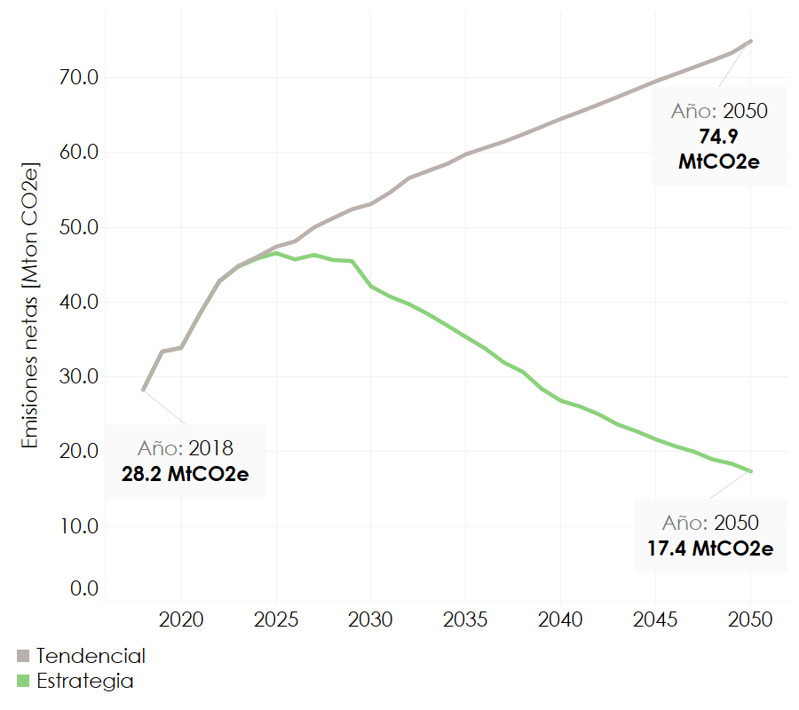

====================================
Resultados Nacionales
====================================

La **Figura 2** compara la trayectoria de las emisiones anuales de GEI en dos escenarios hasta 2050.
El escenarioTendencial muestra un crecimiento sostenido: parte de 25 Mt CO₂e en 2018 y alcanza cerca de 
70 Mt CO₂e en 2050. En contraste, el escenario Estrategia presenta emisiones descendentes a 2050, llegando a
 11 Mt CO₂e. La comparación ilustra el impacto de las medidas de mitigación propuestas, que logran invertir la
tendencia ascendente y reducir las emisiones a apenas una sexta parte del nivel proyectado sin intervención.

   **Figura 2:** Resultados Nacionales
